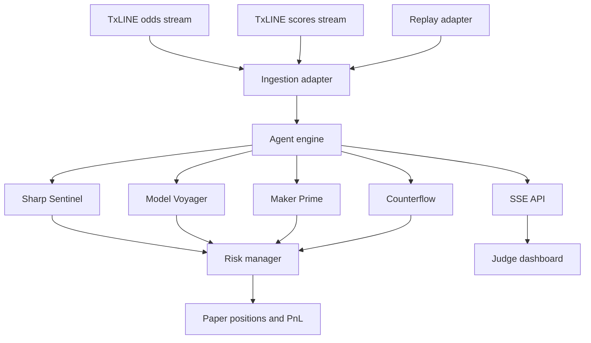

# Technical Overview

## Core Idea

EdgeLine OS is an autonomous World Cup trading-agent control room. Instead of asking a human to watch every match and odds move, it runs specialized agents over TxLINE odds and score data, produces deterministic signals, and tracks whether the strategy would have been profitable.

## Architecture

## Agents

### Sharp Sentinel

Detects sharp movement by looking at probability delta, velocity, and recent dispersion. It flags steam or drift when movement exceeds the configured threshold.

### Model Voyager

Runs an in-play model from score, match clock, and base team strength. It compares model probability against TxLINE consensus implied probability and opens paper positions when edge is large enough.

### Maker Prime

Quotes bid/ask prices using the current market probability, recent volatility, and match clock. The spread widens as uncertainty rises.

### Counterflow

Acts as the arena rival. It fades overextended probability moves when recent z-score suggests a short-term overshoot.

## Risk Controls

- Each agent has a risk limit.
- Signals can be rejected if exposure is too high.
- Market-maker quotes do not open directional exposure.
- Positions are marked to market every tick.
- Closed matches settle paper PnL deterministically.

## TxLINE Integration

Live mode is configured through:

- `TXLINE_NETWORK=devnet` or `mainnet`
- `TXLINE_GUEST_JWT`
- `TXLINE_API_TOKEN`

The code is prepared for:

- `GET /api/fixtures/snapshot`
- `GET /api/odds/stream`
- `GET /api/scores/stream`
- `GET /api/odds/snapshot/:fixtureId`
- `GET /api/scores/snapshot/:fixtureId`

The deterministic replay mirrors the same normalized data shape so the demo remains meaningful when live match volume is low.

## Production Upgrade Path

- Persist ticks, signals, and positions in PostgreSQL.
- Add Redis for stream fan-out.
- Add Prometheus metrics for agent health.
- Add wallet or devnet settlement only if the track reviewer wants executable market interaction.
- Add TxLINE proof receipts to every settled prediction audit trail.
